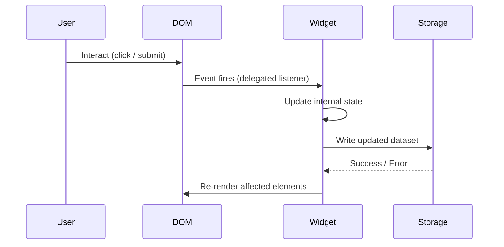

# Design Document: To-Do Life Dashboard

## Overview

The To-Do Life Dashboard is a single-page, client-side web application with no build step, no framework, and no backend. It is delivered as a static `index.html` file that loads one CSS file and one JavaScript file. All state is stored in `localStorage`. The application runs entirely in the browser and is compatible with the latest stable versions of Chrome, Firefox, Edge, and Safari.

The dashboard presents four widgets in a grid layout:

| Widget | Purpose |
|---|---|
| **Greeting_Widget** | Live clock, date, and time-of-day greeting |
| **Focus_Timer** | 25-minute Pomodoro countdown with start / stop / reset |
| **Task_List** | Persistent to-do list with add, edit, complete, and delete |
| **Quick_Links** | Persistent shortcut buttons that open URLs in a new tab |

### Key Design Decisions

- **Vanilla JS only** — no frameworks, no build tools, no npm. The entire application is a single `<script>` tag pointing to `js/app.js`.
- **Module pattern via IIFE** — each widget is encapsulated in its own immediately-invoked function expression to avoid polluting the global scope while keeping the single-file constraint.
- **Event delegation** — the Task_List and Quick_Links use a single event listener on the container element rather than per-item listeners, which keeps memory usage low as lists grow.
- **`visibilitychange` + `Date.now()` for timer accuracy** — the Focus_Timer records an absolute end timestamp when started so that background-tab throttling does not cause drift.
- **No external fonts or icons** — all visual elements use system fonts and Unicode characters to avoid network requests.

---

## Architecture

The application is a single HTML page. There is no routing, no module bundler, and no server-side rendering.

```
index.html
├── <link rel="stylesheet" href="css/styles.css">
└── <script src="js/app.js">
```

### File Structure

```
/
├── index.html          # Shell: semantic HTML, widget containers
├── css/
│   └── styles.css      # All styling — layout, themes, responsive rules
└── js/
    └── app.js          # All behaviour — widgets, storage, event handling
```

### Runtime Execution Flow

```
DOMContentLoaded
  │
  ├── Storage.init()          — validate localStorage availability
  ├── GreetingWidget.init()   — render time/date, start 1-second interval
  ├── FocusTimer.init()       — render 25:00, wire up controls
  ├── TaskList.init()         — load tasks from storage, render list
  └── QuickLinks.init()       — load links from storage, render buttons
```

### Module Structure (inside `app.js`)

```
app.js
├── Storage          — thin wrapper around localStorage (get/set/error handling)
├── GreetingWidget   — clock, date, greeting logic
├── FocusTimer       — countdown logic, control state machine
├── TaskList         — CRUD operations, render loop
└── QuickLinks       — CRUD operations, render loop
```

Each module exposes only an `init()` function. Internal state is held in closure variables. Modules communicate only through the `Storage` module — there is no shared mutable state between widgets.

### Interaction Diagram



---

## Components and Interfaces

### Storage Module

Wraps `window.localStorage` and provides a consistent interface for all read/write operations. Catches `QuotaExceededError` and other storage exceptions and surfaces them as a non-blocking UI warning.

```
Storage.get(key: string) → any | null
Storage.set(key: string, value: any) → { ok: boolean, error?: string }
Storage.KEYS = { TASKS: 'tld_tasks', LINKS: 'tld_links' }
```

**Error handling**: If `localStorage` is unavailable (e.g., private browsing with storage blocked), `Storage.get` returns `null` and `Storage.set` returns `{ ok: false, error: '...' }`. The calling widget is responsible for displaying the warning banner.

---

### GreetingWidget

Owns the `#greeting-widget` DOM section. Runs a `setInterval` every 1000 ms to update the clock display. Checks the hour on each tick and updates the greeting text if the hour boundary has been crossed.

**Greeting boundary logic:**

| Hour range | Greeting |
|---|---|
| 05:00 – 11:59 | Good morning |
| 12:00 – 17:59 | Good afternoon |
| 18:00 – 21:59 | Good evening |
| 22:00 – 04:59 | Good night |

**Interface:**
```
GreetingWidget.init() → void
GreetingWidget._getGreeting(hour: number) → string   // pure, testable
GreetingWidget._formatTime(date: Date) → string      // pure, testable
GreetingWidget._formatDate(date: Date) → string      // pure, testable
```

---

### FocusTimer

Owns the `#focus-timer` DOM section. Uses `Date.now()` to record an absolute `endTime` when the timer starts, so that background-tab CPU throttling does not cause drift. A `setInterval` at 500 ms polls the remaining time and updates the display.

**State machine:**

```
IDLE ──[start]──► RUNNING ──[stop]──► PAUSED ──[start]──► RUNNING
  ▲                  │                                        │
  └──────[reset]─────┘                                        │
  ▲                                                           │
  └──────────────────[reset]─────────────────────────────────┘
  ▲                  │
  └──────[reach 00:00]─────────────────────────────────────► DONE
```

**Interface:**
```
FocusTimer.init() → void
FocusTimer._formatCountdown(seconds: number) → string   // pure, testable
FocusTimer._getState() → 'IDLE' | 'RUNNING' | 'PAUSED' | 'DONE'
```

**Control enable/disable rules:**

| State | Start enabled | Stop enabled | Reset enabled |
|---|---|---|---|
| IDLE | ✓ | ✗ | ✗ |
| RUNNING | ✗ | ✓ | ✓ |
| PAUSED | ✓ | ✗ | ✓ |
| DONE | ✗ | ✗ | ✓ |

---

### TaskList

Owns the `#task-list` DOM section. Uses event delegation on the container to handle complete-toggle, edit, and delete actions. Maintains an in-memory array of `Task` objects that is the single source of truth; the DOM is always derived from this array via a full re-render on any mutation.

**Interface:**
```
TaskList.init() → void
TaskList._addTask(description: string) → void
TaskList._editTask(id: string, newDescription: string) → void
TaskList._toggleTask(id: string) → void
TaskList._deleteTask(id: string) → void
TaskList._render() → void
TaskList._save() → void
TaskList._validateDescription(description: string) → { valid: boolean, message?: string }
```

**Inline edit flow:**
1. User clicks edit → the task `<li>` is replaced with an `<input>` pre-filled with the current description.
2. User presses Enter or clicks a confirm button → `_editTask` is called.
3. User presses Escape → edit is cancelled, original text is restored.

---

### QuickLinks

Owns the `#quick-links` DOM section. Validates that label and URL are non-empty before adding. Prepends `https://` to URLs that lack a scheme. Opens links with `target="_blank" rel="noopener noreferrer"`.

**Interface:**
```
QuickLinks.init() → void
QuickLinks._addLink(label: string, url: string) → void
QuickLinks._deleteLink(id: string) → void
QuickLinks._normalizeUrl(url: string) → string   // pure, testable
QuickLinks._validateLink(label: string, url: string) → { valid: boolean, message?: string }
QuickLinks._render() → void
QuickLinks._save() → void
```

---

## Data Models

All data is serialised as JSON and stored in `localStorage` under fixed keys.

### Task

```json
{
  "id": "string (UUID v4 or Date.now() + random suffix)",
  "description": "string (non-empty, trimmed)",
  "completed": "boolean",
  "createdAt": "number (Unix timestamp ms)"
}
```

**LocalStorage key:** `tld_tasks`  
**Stored value:** JSON array of `Task` objects, e.g. `[{...}, {...}]`

### Link

```json
{
  "id": "string (UUID v4 or Date.now() + random suffix)",
  "label": "string (non-empty, trimmed)",
  "url": "string (always begins with http:// or https://)"
}
```

**LocalStorage key:** `tld_links`  
**Stored value:** JSON array of `Link` objects, e.g. `[{...}, {...}]`

### Storage Key Registry

| Key | Widget | Content |
|---|---|---|
| `tld_tasks` | TaskList | `Task[]` |
| `tld_links` | QuickLinks | `Link[]` |

### ID Generation

IDs are generated client-side using `crypto.randomUUID()` where available, falling back to `Date.now().toString(36) + Math.random().toString(36).slice(2)`. IDs are never reused after deletion.

---

## Layout and Responsive Design

### Desktop Layout (≥ 768px)

```
┌─────────────────────────────────────────────────────┐
│                  Greeting_Widget                    │  ← full width, prominent
├──────────────────────┬──────────────────────────────┤
│     Focus_Timer      │        Task_List             │  ← two columns
├──────────────────────┴──────────────────────────────┤
│                   Quick_Links                       │  ← full width
└─────────────────────────────────────────────────────┘
```

Implemented with CSS Grid:

```css
.dashboard {
  display: grid;
  grid-template-areas:
    "greeting  greeting"
    "timer     tasks"
    "links     links";
  grid-template-columns: 1fr 2fr;
  gap: 1rem;
}
```

### Mobile Layout (< 768px)

All widgets stack vertically in source order via a single media query:

```css
@media (max-width: 767px) {
  .dashboard {
    grid-template-areas:
      "greeting"
      "timer"
      "tasks"
      "links";
    grid-template-columns: 1fr;
  }
}
```

### Typography

| Element | Minimum size |
|---|---|
| Body text | 14px |
| Time display | 24px |
| Greeting heading | 20px |
| Timer display | 48px |

---

## Correctness Properties

*A property is a characteristic or behavior that should hold true across all valid executions of a system — essentially, a formal statement about what the system should do. Properties serve as the bridge between human-readable specifications and machine-verifiable correctness guarantees.*

### Property 1: Greeting boundary coverage

*For any* local hour value (0–23), `GreetingWidget._getGreeting(hour)` SHALL return exactly one of "Good morning", "Good afternoon", "Good evening", or "Good night", and the four hour ranges SHALL be exhaustive and non-overlapping.

**Validates: Requirements 1.3, 1.4, 1.5, 1.6**

---

### Property 2: Time format invariant

*For any* `Date` object, `GreetingWidget._formatTime(date)` SHALL return a string matching the pattern `HH:MM` (two-digit hour, colon, two-digit minute).

**Validates: Requirements 1.1**

---

### Property 3: Countdown format invariant

*For any* integer number of seconds in the range [0, 1500], `FocusTimer._formatCountdown(seconds)` SHALL return a string matching the pattern `MM:SS` where MM is zero-padded minutes and SS is zero-padded seconds, and the total represented time SHALL equal the input.

**Validates: Requirements 2.3**

---

### Property 4: Timer accuracy under elapsed time

*For any* elapsed time in seconds in the range [0, 1500], if the timer was started with a total duration of 1500 seconds and `Date.now()` is mocked to return `startTime + elapsed * 1000`, then the computed remaining time SHALL equal `max(0, 1500 - elapsed)`.

**Validates: Requirements 2.9**

---

### Property 5: Task addition round-trip

*For any* non-empty, non-whitespace task description, after calling `TaskList._addTask(description)`, the task list stored in `localStorage` under `tld_tasks` SHALL contain an entry whose `description` equals the trimmed input and whose `completed` field is `false`.

**Validates: Requirements 3.2, 3.11, 5.1**

---

### Property 6: Whitespace task rejection

*For any* string composed entirely of whitespace characters (spaces, tabs, newlines), `TaskList._validateDescription(description)` SHALL return `{ valid: false }` and the task list SHALL remain unchanged.

**Validates: Requirements 3.3, 3.6**

---

### Property 7: Task completion toggle round-trip

*For any* task in the list, toggling its completion state twice SHALL return the task to its original `completed` value, and the task list length SHALL be unchanged.

**Validates: Requirements 3.7, 3.8**

---

### Property 8: Task edit preserves identity

*For any* task and any valid (non-empty) new description, after calling `TaskList._editTask(id, newDescription)`, the task with that `id` SHALL have its `description` updated to the trimmed new value, its `completed` state SHALL be unchanged, and the total number of tasks SHALL be unchanged.

**Validates: Requirements 3.5**

---

### Property 9: Task deletion reduces list by one

*For any* non-empty task list, after calling `TaskList._deleteTask(id)` for a task that exists in the list, the list length SHALL decrease by exactly one and no task with that `id` SHALL remain in the list.

**Validates: Requirements 3.9**

---

### Property 10: Completed task visual distinction

*For any* array of tasks with arbitrary `completed` states, after rendering the task list, each task element whose `completed` is `true` SHALL have the completed CSS class applied, and each task element whose `completed` is `false` SHALL not have that class.

**Validates: Requirements 3.10**

---

### Property 11: URL normalisation idempotence

*For any* URL string that already begins with `http://` or `https://`, `QuickLinks._normalizeUrl(url)` SHALL return the URL unchanged. *For any* URL string that does not begin with a recognised scheme, the function SHALL prepend `https://` exactly once, so that applying the function a second time produces the same result.

**Validates: Requirements 4.4**

---

### Property 12: Link addition round-trip

*For any* non-empty label and normalised URL, after calling `QuickLinks._addLink(label, url)`, the link list stored in `localStorage` under `tld_links` SHALL contain an entry whose `label` and `url` match the inputs.

**Validates: Requirements 4.2, 4.7, 5.1**

---

### Property 13: Link deletion reduces list by one

*For any* non-empty link list, after calling `QuickLinks._deleteLink(id)` for a link that exists in the list, the list length SHALL decrease by exactly one and no link with that `id` SHALL remain in the list.

**Validates: Requirements 4.6**

---

### Property 14: Storage serialisation round-trip

*For any* array of `Task` objects or `Link` objects, writing the array to `localStorage` via `Storage.set` and then reading it back via `Storage.get` SHALL produce an array that is deeply equal to the original.

**Validates: Requirements 5.1, 5.4, 5.5**

---

## Error Handling

### LocalStorage Unavailable

`Storage.set` wraps every write in a `try/catch`. If an exception is thrown (e.g., `QuotaExceededError`, or storage blocked in private browsing), the module returns `{ ok: false, error: message }`. The calling widget checks this return value and, if `ok` is `false`, displays a non-blocking warning banner at the top of the page. The banner auto-dismisses after 5 seconds or on user click.

### Invalid User Input

Each widget validates input before mutating state:

| Widget | Invalid input | Response |
|---|---|---|
| TaskList | Empty / whitespace description | Inline message below input field; no state change |
| TaskList | Empty description on edit confirm | Inline message; original description retained |
| QuickLinks | Empty label | Inline message identifying "label" field |
| QuickLinks | Empty URL | Inline message identifying "URL" field |

Validation messages are rendered as `<span role="alert">` elements so screen readers announce them immediately.

### Corrupted LocalStorage Data

On `init`, each widget calls `JSON.parse` inside a `try/catch`. If parsing fails (corrupted data), the widget silently falls back to an empty array and overwrites the corrupted entry with a clean empty array on the next save. No data-loss warning is shown for this case because the data is already unrecoverable.

### Timer Edge Cases

- If the browser tab is suspended and resumes after the timer's `endTime` has passed, the timer immediately transitions to the DONE state on the next poll tick.
- The reset control is always available in DONE state to allow the user to start a new session.

---

## Testing Strategy

### Approach

Because this is a pure client-side application with no build tooling, tests are written as standalone HTML test pages that can be opened directly in a browser, or as plain JavaScript files runnable with Node.js for the pure-function modules. No test framework installation is required.

For property-based testing, the library **[fast-check](https://github.com/dubzzz/fast-check)** (loaded via CDN `<script>` tag in the test HTML) is used. Each property test runs a minimum of **100 iterations**.

### Unit Tests (Example-Based)

Focus on concrete scenarios and integration points:

- `GreetingWidget._getGreeting`: one example per boundary (hour 5, 12, 18, 22, 0, 4, 11, 17, 21)
- `FocusTimer._formatCountdown`: 0 seconds → `"00:00"`, 1500 seconds → `"25:00"`, 90 seconds → `"01:30"`
- `TaskList`: add a task, verify it appears; delete a task, verify it is gone; toggle twice, verify state restored
- `QuickLinks._normalizeUrl`: `"example.com"` → `"https://example.com"`, `"https://example.com"` → unchanged
- `Storage`: write then read round-trip; simulate unavailable storage and verify error return

### Property-Based Tests

Each property from the Correctness Properties section is implemented as a single `fc.assert(fc.property(...))` call with at least 100 runs.

| Property | Generator inputs | Assertion |
|---|---|---|
| P1: Greeting boundary coverage | `fc.integer({ min: 0, max: 23 })` | Result is one of four strings; all 24 hours map to a non-null value |
| P2: Time format invariant | `fc.date()` | Output matches `/^\d{2}:\d{2}$/` |
| P3: Countdown format invariant | `fc.integer({ min: 0, max: 1500 })` | Output matches `/^\d{2}:\d{2}$/`; decoded value equals input |
| P4: Timer accuracy under elapsed time | `fc.integer({ min: 0, max: 1500 })` (elapsed seconds) | Remaining time equals `max(0, 1500 - elapsed)` |
| P5: Task addition round-trip | `fc.string({ minLength: 1 }).filter(s => s.trim().length > 0)` | Storage contains task with matching description and `completed: false` |
| P6: Whitespace task rejection | `fc.stringOf(fc.constantFrom(' ', '\t', '\n'))` | `_validateDescription` returns `{ valid: false }`; list unchanged |
| P7: Toggle round-trip | `fc.boolean()` (initial state) | Two toggles restore original state; list length unchanged |
| P8: Edit preserves identity | `fc.uuid()` (id), `fc.string({ minLength: 1 }).filter(s => s.trim().length > 0)` (new desc) | Description updated; completed unchanged; list length unchanged |
| P9: Task deletion reduces list by one | `fc.array(taskArb, { minLength: 1 })` | List length decreases by 1; deleted id absent |
| P10: Completed task visual distinction | `fc.array(taskArb)` with random `completed` states | Each element has/lacks completed class matching its state |
| P11: URL normalisation idempotence | `fc.webUrl()` and `fc.string()` | Already-schemed URLs unchanged; applying twice is idempotent |
| P12: Link addition round-trip | `fc.string({ minLength: 1 })` (label), `fc.webUrl()` (url) | Storage contains link with matching label and url |
| P13: Link deletion reduces list by one | `fc.array(linkArb, { minLength: 1 })` | List length decreases by 1; deleted id absent |
| P14: Storage round-trip | `fc.array(fc.record({ id: fc.uuid(), description: fc.string(), completed: fc.boolean(), createdAt: fc.integer() }))` | Deep equality after write + read |

**Tag format for each test:**
```js
// Feature: todo-life-dashboard, Property N: <property_text>
```

### Integration / Smoke Tests

- Open `index.html` in each target browser; verify all four widgets render without console errors.
- Add a task, reload the page, verify the task persists.
- Add a link, reload the page, verify the link persists.
- Resize viewport below 768px; verify all widgets stack vertically.
- Start the timer, switch tabs for 30 seconds, return; verify the timer has counted down correctly.
